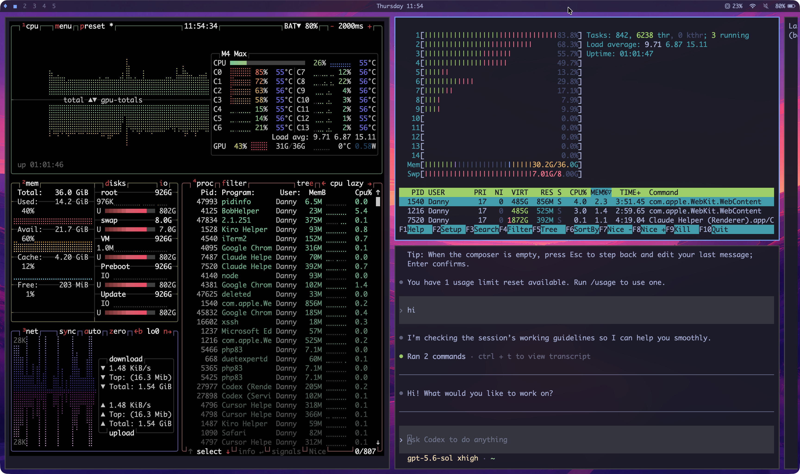
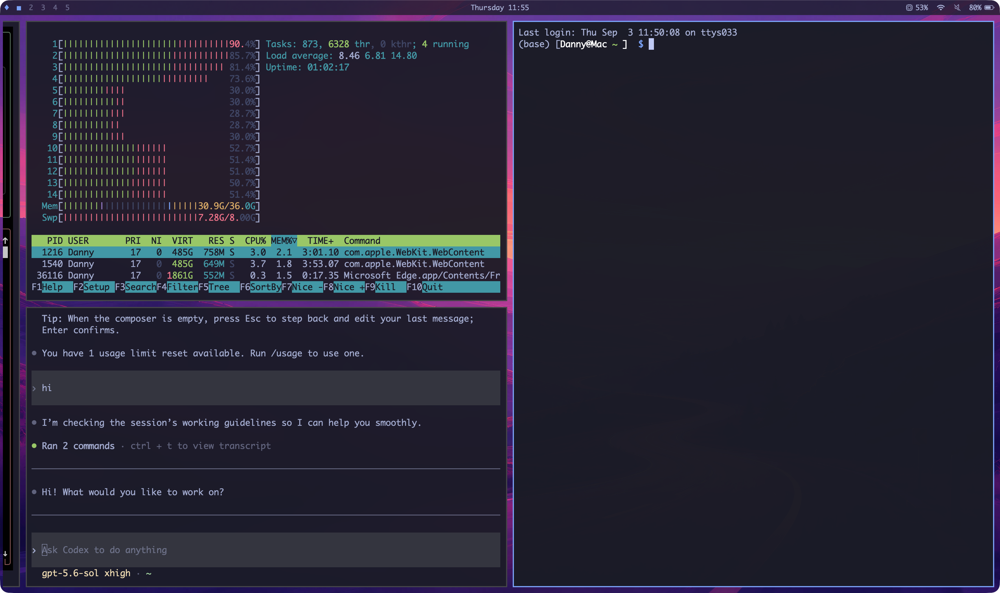

# QuickTerm

**An Omarchy-style tiling terminal for macOS, powered by libghostty.**

QuickTerm puts the feel of [Omarchy](https://omarchy.org)'s Hyprland desktop inside a single native macOS window — and fills it with terminals. Infinite horizontal scrolling layout, workspaces, floating panes, a waybar-style status bar, 22 Omarchy themes with wallpapers, and the same `Super` → `Cmd` keybindings. The terminal engine is [Ghostty](https://ghostty.org)'s own library (GhosttyKit, pinned to v1.3.1), so rendering, ligatures, and VT fidelity are identical to Ghostty itself.

[中文说明](README.zh-CN.md)





---

## Highlights

- **Scrolling canvas by default** — each workspace is an endless horizontal strip of columns (Hyprland `scrolling` layout: two columns per screen by default, with a sliver of each neighbouring column peeking in at the edges). New terminals open to the right of the focused column; the viewport follows focus with minimal scrolling. Classic **dwindle** tiling is one `Cmd+L` away.
- **Hover to focus** — move the mouse over a pane and it's active. Border turns to the theme accent, keystrokes go straight in.
- **Floating panes** — `Cmd+T` lifts a pane out of the tiling; `⌘`+drag moves it, `⌘`+right-drag resizes it.
- **Five workspaces** — `Cmd+1…5` to switch, `Cmd+Shift+1…5` to move a pane along. Scroll the status bar to cycle.
- **waybar-style status bar** — workspaces, clock, CPU, network, volume, battery. 26pt, monochrome SF Symbols, translucent.
- **22 Omarchy themes** with all their wallpapers, hot-switched in under a frame; pick any image of your own as a background.
- **Glass** — panes at 0.92 opacity over a continuous wallpaper, active pane composites to 0.98, inactive tiled panes get a frosted backdrop (text stays sharp). One key toggles it all off.
- **Your Ghostty config just works** — fonts, cursor, scrollback, shell integration and terminal-level keybinds are read from `~/.config/ghostty/config`. QuickTerm only layers theme colours and padding on top.
- **Everything rebindable** — every window-manager action is a key in `config.toml`; `Cmd+K` shows the live cheat sheet.
- **State restore** — layouts, floating panes, active workspace and each pane's working directory come back on launch.

## Install

Pre-built DMGs are on the [Releases](https://github.com/dannyzhu/QuickTerm/releases) page (universal binary for Apple Silicon and Intel, macOS 15+).

1. Open the DMG and drag **QuickTerm** into **Applications**.
2. The app is ad-hoc signed and not notarized, so macOS blocks the first launch. Double-click it once and dismiss the "Apple could not verify…" dialog, then either:
   - open **System Settings → Privacy & Security**, scroll down to the QuickTerm entry and click **Open Anyway**, or
   - clear the quarantine flag from a terminal (no more dialogs after this):
     ```bash
     xattr -dr com.apple.quarantine /Applications/QuickTerm.app
     ```
3. Launch it again. The first window opens a shell in your home directory.

Optional: with the DMG and its `.sha256` file in the same folder, run `shasum -a 256 -c QuickTerm-<version>.dmg.sha256` to verify the download. To build your own DMG from source, follow [Build](#build) and then run `scripts/make-release.sh`.

## Build requirements

Only needed to build from source. The DMG from Releases runs on any Mac (Apple Silicon or Intel) with macOS 15+ and needs none of this.

- macOS 15 or later (developed on macOS 26 / Xcode 26.6, Apple Silicon)
- Xcode 26+ with the Metal Toolchain: `xcodebuild -downloadComponent MetalToolchain`
- [XcodeGen](https://github.com/yonaskolb/XcodeGen): `brew install xcodegen`
- Zig is installed automatically into `.tools/` at the exact version Ghostty pins

## Build

```bash
git clone --recurse-submodules <this repo>
cd quickterm
scripts/build-ghosttykit.sh      # installs the pinned Zig into .tools/, then builds vendor/ghostty/macos/GhosttyKit.xcframework (10–30 min first time)
# GHOSTTYKIT_TARGET=universal scripts/build-ghosttykit.sh   # arm64 + x86_64 universal library (needed for release DMGs; ~2× build time)
scripts/fetch-themes.sh          # pulls Omarchy theme wallpapers (not in git, ~50 MB)
xcodegen generate
xcodebuild -project QuickTerm.xcodeproj -scheme QuickTerm -configuration Debug build
```

Behind a proxy, Zig's dependency fetch inside `build-ghosttykit.sh` may fail with HTTP 400 — Zig's fetcher ignores system proxy settings. Run `scripts/fetch-zig-deps.sh` (it uses the Zig the build script just installed and seeds Zig's cache through curl), then re-run `scripts/build-ghosttykit.sh`.

Run the built app:

```bash
open "$(xcodebuild -project QuickTerm.xcodeproj -scheme QuickTerm -configuration Debug -showBuildSettings 2>/dev/null | awk '/ BUILT_PRODUCTS_DIR/{print $3}')/QuickTerm.app"
```

Tests (59 cases, run inside the app as test host):

```bash
xcodebuild -project QuickTerm.xcodeproj -scheme QuickTerm -configuration Debug test
```

## Using QuickTerm

### Layouts

**Scrolling** (default for every workspace). Columns are 49% of the viewport wide by default — that's "2 visible columns" (`0.98 / N`). When everything fits, columns scale up to fill the width (a single column is full-screen, two columns have equal gaps left/middle/right). When they don't, the viewport scrolls the minimum needed to keep the focused column fully visible. Change the number of visible columns from the main menu (cycles 2 → 3 → 4) or set `visible-columns` in config. Two-finger horizontal swipe pans the canvas; it snaps to a column edge on release.

`Cmd+J` merges a single-pane column into the column on its left (as a vertical stack) or splits the focused pane out of a multi-pane column into its own column.

**Dwindle** (`Cmd+L` toggles per workspace). Recursive binary splitting like Omarchy: the focused pane splits right if it's wider than tall, otherwise down. `Cmd+J` flips the last split direction. Drag dividers to resize; double-click a divider to equalise.

Switching layouts keeps every pane in order (columns become right-splits, stacks become down-splits).

### Floating panes and Scratchpad

`Cmd+T` floats the focused pane at 75% of the default column width × 45% of the content height, centred. Hold `⌘` and drag with the left button to move (it comes to the front), right button to resize. Press `Cmd+T` again to tile it back. Floating panes move between workspaces with `Cmd+Shift+N` and are saved with the layout.

`Cmd+S` opens the Scratchpad — one global terminal that overlays any workspace (70% × 60%, centred). Click outside to hide it.

### Mouse

| Gesture | Effect |
|---|---|
| Hover | Focus follows the mouse |
| `⌘` + left-drag a tiled pane | Drop on a pane's centre to swap. Drop on an edge: in scrolling, insert a column beside it (left/right) or stack into it (top/bottom); in dwindle, split on that side |
| `⌘` + left-drag a floating pane | Move (raises to front) |
| `⌘` + right-drag | Resize: column width in scrolling, nearest divider in dwindle, the pane itself if floating |
| Scroll wheel over the status bar | Cycle workspaces |
| Two-finger horizontal swipe | Pan the scrolling canvas |
| Double-click empty status bar | Zoom window to the visible screen area |
| Click clock / speaker / workspace pill | Toggle date format / mute / jump to workspace |

### Panels

All panels are centred, Walker-style: `↑`/`↓` to move, `Return` to choose, `Esc` or click outside to close.

- **Theme picker** (`Cmd+Ctrl+Shift+Space`) — name, a `light` tag on light themes, and an 8-colour swatch per theme.
- **Background picker** (`Cmd+Ctrl+Space`) — 3-column thumbnail grid; `←`/`→` move one, `↑`/`↓` move a row. Press the same key again while it's open to jump to the next background. The last tile, **Choose image…**, opens a file dialog; the image is copied to `~/.config/quickterm/backgrounds/` and applied immediately. Your own images stay available across all themes.
- **Keybinding cheat sheet** (`Cmd+K`) — generated from the live keymap, so it always reflects your overrides.
- **Main menu** (`Cmd+Alt+Space`) — New terminal · Themes · Backgrounds · Visible columns · Toggle bar · Toggle gaps · Toggle opacity · Keybindings · Settings · About.

### Transparency

| Setting | Default | What it does |
|---|---|---|
| `pane-opacity` | 0.92 | Terminal background opacity (engine `background-opacity`) |
| `active-opacity` | 0.98 | The focused pane is composited over a theme-coloured underlay up to this value |
| `bar-opacity` | 0.75 | Status bar background |
| `divider-opacity` | 0.2 | Opacity of the 1pt divider line between dwindle splits (1 = solid, 0 = hidden) |
| `dwindle-gap` | 3 | Padding around each dwindle pane in pt (neighbours are 2×gap + 1pt divider apart; scrolling keeps 5) |
| `inactive-blur` | 2.5 | `> 0` puts a frosted-glass backdrop behind inactive tiled panes (blurs the wallpaper, not the text; floating panes are exempt; the numeric value is currently on/off only) |

`Cmd+Backspace` turns all of it off at once (panes and bar go opaque); `Cmd+Shift+Backspace` toggles the gaps.

## Default keybindings

Every action below can be rebound in `config.toml` (see [Configuration](#configuration)). Keys not in this table are passed straight to the terminal — `Cmd+C`/`Cmd+V`, font-size keys, `Cmd+Q` etc. are untouched. `Cmd+Q` asks for confirmation while any pane is open and quits immediately when there are none.

| Key | Action id | What it does |
|---|---|---|
| `Cmd+Return` | `new-terminal` | New terminal (right of the focused column / dwindle split), inherits cwd |
| `Cmd+W` | `close-pane` | Close focused pane (confirms if a process is running). Closing the last pane keeps the window open with a hint; the app does not quit |
| `Cmd+←↑↓→` | `focus-*` | Move focus |
| `Cmd+Shift+←↑↓→` | `swap-*` | Swap pane / column; viewport follows |
| `Cmd+J` | `toggle-split-dir` | Merge/split column (scrolling) · flip split (dwindle) |
| `Cmd+F` | `toggle-zoom` | Zoom pane to fill the content area |
| `Cmd+Ctrl+←↑↓→` | `resize-*` | Resize — column width in scrolling (left/right only), all four directions in dwindle; `Shift` gives fine steps in dwindle |
| `Cmd+Ctrl+=` | `equalize` | Equalise all / reset column widths |
| `Alt+Tab` / `Alt+Shift+Tab`, `Cmd+]` / `Cmd+[` | `cycle-pane-next` / `-prev` | Cycle panes |
| `Cmd+L` | `toggle-layout` | Scrolling ⇄ dwindle |
| `Cmd+T` | `toggle-float` | Float ⇄ tile |
| `Cmd+S` | `scratchpad` | Scratchpad terminal |
| `Cmd+1…5` | `goto-workspace-N` | Switch workspace (`Cmd+6…9,0` when `workspaces > 5`) |
| `Cmd+Shift+1…5` | `move-to-workspace-N` | Move pane to workspace and follow |
| `Cmd+Shift+Space` | `toggle-bar` | Show/hide status bar |
| `Cmd+Ctrl+Shift+Space` | `theme-picker` | Theme picker |
| `Cmd+Ctrl+Space` | `next-background` | Background picker / next background |
| `Cmd+Backspace` | `toggle-opacity` | Transparency on/off |
| `Cmd+Shift+Backspace` | `toggle-gaps` | Gaps on/off |
| `Cmd+K` | `keybind-help` | Cheat sheet |
| `Cmd+Alt+Space` | `main-menu` | Main menu |
| `Cmd+,` | `open-settings` | Open `config.toml` (and your ghostty config if present) |
| `Ctrl+Cmd+F` / `Cmd+Esc` | `toggle-fullscreen` / `exit-fullscreen` | Non-native fullscreen (hides Dock and menu bar) |

Two deliberate deviations from Omarchy: resizing uses `Cmd+Ctrl+arrows` because `Cmd+-`/`Cmd+=` are font-size keys in every macOS terminal, and `Cmd+K` is the cheat sheet rather than "clear screen" (bind your own clear key in your ghostty config if you want one).

The Shell and Pane menus in the macOS menu bar list fixed default shortcuts for a few actions and don't follow rebinds; the cheat sheet (`Cmd+K`) always does.

## Configuration

`~/.config/quickterm/config.toml` — created with a commented template the first time you press `Cmd+,`. It hot-reloads on save.

```toml
# theme = "tokyo-night"     # or "ghostty": don't touch colours, follow ~/.config/ghostty/config entirely
# workspaces = 5            # 1–10
# pane-padding = 14         # terminal padding in pt, 0–32 (Omarchy's value)
# visible-columns = 2       # scrolling columns per screen, 1–6
# pane-opacity = 0.92       # 0.5–1.0
# active-opacity = 0.98     # 0.5–1.0
# bar-opacity = 0.75        # 0–1
# divider-opacity = 0.2     # 0–1, dwindle split divider line
# dwindle-gap = 3           # 0–20 pt, padding around each dwindle pane
# inactive-blur = 2.5       # > 0 enables frosted inactive panes

[keybinds]                  # action = "modifiers+key"; "none" unbinds. Action ids: Cmd+K
# new-terminal = "cmd+return"
# toggle-float = "cmd+shift+t"

[ghostty]                   # any Ghostty option, passed through verbatim, highest priority
# cursor-style = block
# font-size = 13
```

Modifier names: `cmd`/`command`/`super`, `shift`, `alt`/`option`/`opt`, `ctrl`/`control`. Key names: single characters, or `left` `right` `up` `down` `return` `tab` `space` `backspace` `escape`. One binding per action — an override replaces all of that action's defaults.

### How the engine is configured

Ghostty's configuration is assembled in five layers, later ones override earlier ones:

1. libghostty built-in defaults
2. QuickTerm's bundled fallback (`ghostty-default.conf`: Monaco 15, the Builtin Pastel Dark theme, copy-on-select, 100M scrollback, option-as-alt …) — loaded **only when you have no Ghostty config file at all**; it steps aside entirely as soon as one exists
3. **`~/.config/ghostty/config`** — loaded with Ghostty's own rules, including `config-file` includes. Fonts, cursor, scrollback, shell integration and terminal-level `keybind =` lines all apply.
4. QuickTerm's overlay (`~/Library/Application Support/QuickTerm/engine-overlay.conf`, regenerated on theme change): colours and palette from the active theme, `window-padding-x/y`, `background-opacity`, `unfocused-split-opacity`, and `window-vsync = false` (see Troubleshooting). Set `theme = "ghostty"` to keep only the padding.
5. The `[ghostty]` section of `config.toml`, appended last.

One quirk of Ghostty's loader: files pulled in through `config-file` includes are applied *after* layers 4 and 5, so a colour set in an included file wins over QuickTerm's theme. Keep colours in the top-level `~/.config/ghostty/config` (or let QuickTerm own them) if you want themes to apply.

### Files and directories

| Path | Purpose |
|---|---|
| `~/.config/quickterm/config.toml` | QuickTerm settings (hot-reloaded) |
| `~/.config/quickterm/themes/<name>/{colors.toml, backgrounds/}` | Your own themes; same name as a built-in overrides it |
| `~/.config/quickterm/backgrounds/` | Your own wallpapers, available in every theme |
| `~/.config/ghostty/config` | Your Ghostty config, reused as-is |
| `~/Library/Application Support/QuickTerm/` | `engine-overlay.conf` and `state.json` (restored layouts) |

## Troubleshooting

- **Zig dependency fetch fails with 400 / HttpConnectionClosing** — Zig's fetcher ignores the system proxy. Let `scripts/build-ghosttykit.sh` install Zig first (it will stop at the fetch step), then run `scripts/fetch-zig-deps.sh` (pre-fetches through curl and seeds Zig's cache) and re-run the build script.
- **Link errors: many undefined symbols (`_sigaction`, …)** — Xcode 26's SDK ships an arm64-less `libSystem.tbd`. `scripts/build-ghosttykit.sh` applies an SDK overlay automatically; always build through the script, not `zig build` by hand.
- **`cannot execute tool 'metal'`** — install the Metal Toolchain (see Requirements).
- **`xcodebuild` can't find `GhosttyKit.xcframework`** — run `scripts/build-ghosttykit.sh`, then `xcodegen generate`.
- **Background picker only shows the "Choose image…" tile** — theme wallpapers aren't in git; run `scripts/fetch-themes.sh` and rebuild.
- **Every new terminal fails after opening hundreds of panes** — macOS 26 has a per-login-session quota on the deprecated `CVDisplayLink` API. QuickTerm sidesteps it by injecting `window-vsync = false`. If you override it back to `true` and hit the quota, log out and back in.

More background on each of these is in [`docs/porting-notes.md`](docs/porting-notes.md).

## Architecture in one paragraph

AppKit owns state and lifecycle; SwiftUI only renders. `MainWindowController` is the single owner of window-manager state and dispatches every action; layouts are immutable value types (`ScrollingStrip` for the scrolling canvas, Ghostty's `SplitTree` for dwindle) so workspaces are just an array of values and persistence is `Codable`. The Ghostty embedding layer (`Sources/GhosttyEmbed/`) is ported from Ghostty's own macOS app (MIT) with QuickTerm changes marked by `// QuickTerm：` comments (note the full-width colon). Hover and click focus on overlapping panes is resolved by model geometry (`HoverOcclusion`) rather than AppKit `hitTest`, so the drag-source overlays that appear while `⌘` is held can't steal focus; `⌘`-drag targets use `hitTest` with a z-ordered geometric fallback.

- Design document: [`docs/superpowers/specs/2026-08-31-quickterm-design.md`](docs/superpowers/specs/2026-08-31-quickterm-design.md)
- Porting notes and environment gotchas: [`docs/porting-notes.md`](docs/porting-notes.md)
- Acceptance checklists: [`docs/acceptance/`](docs/acceptance/)

## Credits

- [Ghostty](https://github.com/ghostty-org/ghostty) by Mitchell Hashimoto — terminal engine and the embedding code in `Sources/GhosttyEmbed/` (MIT).
- [Omarchy](https://github.com/basecamp/omarchy) by DHH and contributors — the design, the keybindings, and the 22 themes with their wallpapers (MIT).

## License

MIT — see [`LICENSE`](LICENSE). Ghostty and Omarchy assets retain their own MIT licences and copyright notices.
